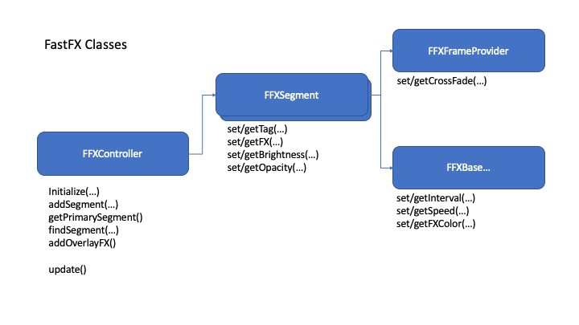

# FFX - FastFX library
<a id="markdown-FFX%20-%20FastFX%20library" name="FFX%20-%20FastFX%20library"></a>

## Table of Contents
<a id="markdown-Table%20of%20Contents" name="Table%20of%20Contents"></a>

<!-- TOC depthfrom:2 withlinks:true -->

- [Table of Contents](#table-of-contents)
- [Intro](#intro)
- [Overview](#overview)
    - [Dependency](#dependency)
- [Model](#model)
- [Tutorial & Examples](#tutorial--examples)
    - [FirstLight](#firstlight)
        - [Cycle and Phase](#cycle-and-phase)
        - [Initialization](#initialization)
        - [Speed and Cross-fade](#speed-and-cross-fade)
    - [FirstLight 2](#firstlight-2)
        - [MovementType](#movementtype)
        - [Color](#color)
        - [NamedPalettes](#namedpalettes)
    - [FirstLight 3](#firstlight-3)
        - [Segments](#segments)
        - [Overlay Effects](#overlay-effects)
        - [Timers](#timers)

<!-- /TOC -->

## Intro
<a id="markdown-Intro" name="Intro"></a>

Thanks for checking out FFX.  This project grew out my desire to have a single code-base for several different LED Strips I have installed in various locations around my home.  My goal was to have a single firmware image that could be downloaded on every controller, yet have the ability to change the colors/effects/etc. independently.  That goal has been realized in a forthcoming framework that utilizes MQTT, JSON and a message based system for configuration and control of individual nodes (LED Controllers, sensors, relays, etc).  The FFX library is the foundation for the LED controller used in that architecture.

The examples in the following sections illustrate the basics, but don't touch on everything.  All of the coding and development was done on NodeMCU ESP8266 boards.  While I haven't tested on anything else, outside of the FastLED initialization and pin selection, it doesn't do anything that is processor dependent, so it should run just as well on other platforms.  

Final Note - The examples included in the framework are optimized for WS2811 strips (12v 3-LEDs per pixel).  Some of the default parameters may need to be tweaked slightly to look best on other strip configurations. 

## Overview
<a id="markdown-Overview" name="Overview"></a>

FFX is an Arduino library that for creating LED Strip effects and animations.  The principle idea behind the library is to provide a set of reusable classes/objects to create and display multiple colors/animations/etc. consistently in any sketch.  Effects are written as classes/subclasses and displayed by a common controller object. By defining effects as objects, FFX is able to provide capabilities that are common to all effects without the need to custom code them for each individual effect.  These capabilities include:

- Automatic crossfade between "frames" - useful for smoother transitions in slower moving sequences.
- Automatic crossfade between effects - gradual fade between effects when changing from one effect to another
- Segments - Multiple effects shown in different segments of the same Strip
- Transparency - One effect shown over the top of another with variable transparency (while both continue to animate)
- Common Color/Palette Management - Color object/interface to change the look of effects without custom coding each color/combination
- Independent timing - Each effect maintains its own independent Timer
- Overlay Sequences - Brief animation sequences that can be show over the top of looping effects (with variable transparency).  Useful for indicating events, transitions, etc.  
- Auto-faders for dimming and transparency - allows for smooth transitions when changing brightness and/or transparency levels.  Timing can be set independently for each.  

### Dependency
<a id="markdown-Dependency" name="Dependency"></a>

The FastFX library requires the FastLED library: https://github.com/FastLED/FastLED.  Users attempting to use this library should have a basic understanding of FastLED and have the library installed and working (version 3.3 or greater).

The library also makes use of 2 timer classes (StepTimer, FlexTimer).  These are included in the repository, but may be released as a separate library at some time in the future.

## Model
<a id="markdown-Model" name="Model"></a>

The programming model for using FastFX differs slightly from coding directly with FastLED. The following is a brief description of the classes needed to create a sketch using FastFX:



- **FFXBase** - Each effect is written as a subclass of the FFXBase class.  FFXBase has its own timing parameters that determine how many milliseconds each "frame" will last.  The smaller the interval, the faster the animation.  FFXBase provides two virtual methods that may be overridden.  The most important is the WriteNextFrame() method. This method is used to make changes to a FastLED CRGB array (\*CRGB[]) that represents the pixels to draw.  The FastFX framework includes several pre-built effect classes, including the default SolidFX class, which represents a single static color (see FXXCoreEffects.h)

- **FFXSegment** - A single LED strip is represented by a set of one or more segments.  Each strip contains a *Primary* segment, which represents the entire strip.  If effects will only be displayed along the entire strip, this is the only segment that needs to be present.  If multiple effects are desired, then additional *secondary* segments may be defined.  These segments may each have a different effect and each has its own *opacity* setting (0-255, 0=100% transparent, 255=100% opaque).  The secondary segments do not need to cover the entire length of the primary segment.  Pixels in the primary segment will always be visible unless they are covered by a secondary segment (and the secondary segment's opacity is greater than 0).

     Each secondary segment is given a name or _Tag_, which is used to reference that segment on the controller.  The controller provides 2 methods to access the individual segments - getPrimarySegment() and findSegment(String tag), each returns a pointer to the appropriate segment.  Note that these pointers can be dereferenced safely without checking for NULLs, if an invalid segment name is specified for findSegment, a pointer to the primary segment will be returned.  


    Each segment maintains a FFXFrameProvider object that is responsible for returning the frames to be drawn for each update.  The frame provider manages the cross fading, allocating extra buffers when needed.

- **FFXController** - This is the main interface for the FastFX framework.  Every FastFX sketch will create an FFXController object and then use that object to define segments, start/stop effects and set various other parameters (brightness, opacity, speed, etc).

## Tutorial & Examples
<a id="markdown-Tutorial%20%26%20Examples" name="Tutorial%20%26%20Examples"></a>

### FirstLight
<a id="markdown-FirstLight" name="FirstLight"></a>

Since each effect is a standalone class, creating a new one is a straightforward task.  Taking from the "FirstLight" example code in the FastLED library, we will create a FastFX version and see how we gain additional functionality with FastFX.  First we'll construct the effect class, which is always a descendant of FFXBase:

~~~c++ 
class FirstLightFX : public FFXBase {
  public:    
    // Constructor - provides defaults for interval, minInterval, and maxInterval
    FirstLightFX(uint16_t initSize) : FFXBase( initSize, 10UL, 10UL, 100UL ) {
    // currColor holds the FFXColor object used to manage colors in effects - this is a
    // simple single-color effect using RGB colors, so we set the mode to singleCRGB
    currColor.setColorMode( FFXColor::FXColorMode::singleCRGB |
    // then supply it the color
    currColor.setCRGB( CRGB::White |
    // effect is running on a segment of the strip.
    }

    // Override initLeds - this method is called only once, right before the first frame is drawn
    // Note that anything done here is not "shown" until after the first call to writeNextFrame()
    virtual void initLeds( CRGB *bufLeds ) override {
    // Clear the field
    fill_solid( bufLeds, getNumLeds(), CRGB::Black |
    }

    // Override writeNextFrame - this is what is called for each change.  Note that the controller
    // will only call this once for each frame, so we don't need to track anything about the Timing
    // or coordination with other effects...just write the frame data into the passed CRGB array
    virtual void writeNextFrame( CRGB *bufLeds ) override {
    // fade any lit pixels to leave a trail behind the moving colored pixel
    fadeToBlackBy( bufLeds, numLeds, 50 |
    // set the next pixel to the current value in our FFXColor object (white, in this case)
    bufLeds[getCurrPhase()-1] = currColor.getCRGB(|
    }
};
~~~

#### Cycle and Phase
<a id="markdown-Cycle%20and%20Phase" name="Cycle%20and%20Phase"></a>

Note the use of `getCurrPhase()` here.  All effects have running counters for _Phase_ and _Cycle_.  The Phase counter starts at 1, and increments for each step until it reaches the number of pixels covered by that effect.  This is considered one cycle.  Once a cycle is completed, the phase is reset to 1.  The `getCurrCycle()` method returns the count of how many times this has been repeated.  For an effect running at an interval of 10 (milliseconds) with 100 pixels, a single phase will take 10 milliseconds, while a full cycle will take 1 second (1000 milliseconds).   

Note that the use of Phase and Cycle in implementing effects is not mandatory. An effect can completely ignore them and still be 100% functional.  They simply provide some convenient reference points and can be very useful for calculating motion and timing when used appropriately.

#### Initialization
<a id="markdown-Initialization" name="Initialization"></a>

For FastLED, we need the CRGB array that represents the pixels in our strip, and we will also need a FFXController object for FastFX.  So, the following 2 globals are defined:

```c++
CRGB leds[NUM_LEDS]
FFXController fxctrlr = FFXController(|
```
Now we can modify the setup() function to create and initialize an instance of the FFXController, and create and add the effect to the controller:

```c++
void setup() {
    pinMode( 5, OUTPUT |
    FastLED.addLeds<WS2811, DATA_PIN, GRB>(leds, NUM_LEDS|
    FastLED.clear(|

    fxctrlr.initialize( new FFXFastLEDPixelController( leds, NUM_LEDS ) |
    fxctrlr.getPrimarySegment()->setFX( new FirstLightFX( NUM_LEDS ) |
    fxctrlr.getPrimarySegment()->setBrightness( 100 |
}
```

Now that we've built all of the instructions for creating the effect into our FirstLightFX class and added it to the controller, the main loop simply needs to make sure the controller continues to run:

```c++
void loop() {
  fxctrlr.update(|
}
```
The full code can be found in [examples/FirstLight_1/FirstLight_1.ino](examples/FirstLight_1/FirstLight_1.ino).  

#### Speed and Cross-fade
<a id="markdown-Speed%20and%20Cross-fade" name="Speed%20and%20Cross-fade"></a>

When running this example, note that you may select a different interval value to control the speed of the animation.  Thas may be done by calling:
```c++
fxctrlr.getPrimarySegment()->getFX().setInterval( newInterval |
```  
The interval may be changed any time after creating the effect.  By using a larger interval (200+ milliseconds), you may notice that the leading white dot fades in over the duration of that interval to make the animation smoother.  This is because crossfading is enabled by default by the framework.  The extra buffers and frame-blending are all done automatically.  This can be disabled on any individual effect by calling
```c++
fxctrlr.getPrimarySegment()->getFrameProvider()->setCrossFade(false)
```

### FirstLight 2
<a id="markdown-FirstLight%202" name="FirstLight%202"></a>

#### MovementType
<a id="markdown-MovementType" name="MovementType"></a>

 In the above example, the movement is uni-directional - in only goes from low to high and starts over.  All FastFX effect have a MovementType setting, which can be set using `setMovement( MovementType )` and inspected using `getMovement()`.  This may be used to support more flexible patterns of motion without having to code each individually.  The Phase of the effect can be inspected normally through `getCurrPhase()`, but it may also be interpreted through `getMovementPhase()`, which will interpret the Phase in respect to the MovementType setting on the effect as follows:

 | MovementType | MovementPhase |
 | --- | --- |
 | MVT_FORWARD | The phase increments normally and resets to 1 at the end of each cycle. |
 | MVT_BACKWARD | The phase is reversed, starting at the highest value and resetting at 1. |
 | MVT_BACKFORTH | The phase switches between forward and backward for alternating cycles. |
 | MVT_RANDOM | The phase is a random value between 1 and the highest phase (number of LEDs in the segment) |
 | MVT_STILL | The phase never changes - always returns 1. |


#### Color
<a id="markdown-Color" name="Color"></a>

All effect objects (descendant of FFXBase) have a FFXColor object that may be accessed by calling `getFXColor()`.  This can be used to modify the way the color behaves any time after the initial construction.  The FFXColor object returned has methods to change and inspect the current color.  The `getCRGB()` method returns the current CRGB value for a given pixel based on the settings and the *mode* specified for the FFXColor object.  Mode may be set to the following values:

| Mode | Description |
| --- | --- |
| singleCRGB | getCRGB() always returns the last value set using setCRGB() method. |
| singleCHSV | getCHSV() always returns the last value set using setCHSV(). |
| palette16 | Returns colors from a 16 (or fewer) entry palette set with setPalette().  Useful for effects that use a limited number of colors.  |
| palette256 | Returns colors from a 256 entry gradient palette.  See discussion below on the nuances between the 2 palette-based color modes. |

The palette-based color modes work in similar ways and are used to automatically step through colors in palettes using additional methods (step, shift) as follows:

- step() - steps forward 1 entry in the palette.  Each time step() is called, the next entry will be returned by getCRGB().  Once the last entry is returned, the next call to step() starts over at the first entry.  In palette16 mode, this steps forward to the next entry.  The setRange() method can be used to set the number of colors this will step through.  So, calling setRange(4) will result in cycling through the first four colors in the palette repeatedly.  In palette256 mode, step increments to the next value (among all 256 entries).
- shift() - This shifts the pallete forward 1 place (out of 256 total).  Shift is useful if an effect needs to fill an array using step().  Then shift() may be used to shift the palette forward 1 place before the next cycle.  Only applies to palette256 mode, this is not particularly useful in palette16 mode.

FFXColor may also be used as just a means to store a palette used by the effect by using only `setPalette()` and `getPalette*()`

There is no requirement for Effects to use this object at all - colors may also be hard-coded, or customized in any other way in each effect's `writeNextFrame()` method.  

A small change to the `writeNextFrame()` method will allow us to support the palette color modes as follows:  if the mode is palette16, the effect will step to the next color at either end of the strip (or segment) on which it is running. In palette256 mode, the effect will simply step through entire palette as it moves.

```c++
virtual void writeNextFrame( CRGB *bufLeds ) override {
fadeToBlackBy( bufLeds, numLeds, 50 |
bufLeds[getMovementPhase()-1] = currColor.getCRGB(|
switch (currColor.getColorMode()) {
  // Blend the moving pixel through the entire palette range
  case FFXColor::FFXColorMode::palette256 : { 
    currColor.step(| 
    break; 
  }
  // Step through the active colors in the palette - switching at either end of the strip
  case FFXColor::FFXColorMode::palette16 : { 
    if (getCurrPhase()==0 || getCurrPhase()==numLeds) { 
currColor.step(| 
    } 
    break; 
  }
  default:  { }
}
    }
```
The full code can be found in [examples/FirstLight_2/FirstLight_2.ino](examples/FirstLight_2/FirstLight_2.ino).  
Changing the color for our FirstLight effect can be done right after we initialize and add the effect to the FFXController:

singleCRGB:

```c++
FFXColor &clr = fxctrlr.getPrimarySegment()->getFX()->getFXColor(|
clr.setCRGB( CRGB::Red |
```

palette256:

```c++
   FFXColor &clr = fxctrlr.getPrimarySegment()->getFX()->getFXColor(|
   clr.setColorMode( FFXColor::FFXColorMode::palette256 |
   clr.setPalette( NamedPalettes::getInstance()["party"] |
```

palette16: 

```c++
    FFXColor &clr = fxctrlr.getPrimarySegment()->getFX()->getFXColor(|
    clr.setColorMode( FFXColor::FFXColorMode::palette16 |
    clr.setPalette( NamedPalettes::getInstance()["multi"] |
    clr.setPaletteRange( 6 |
```

#### NamedPalettes
<a id="markdown-NamedPalettes" name="NamedPalettes"></a>

Note in the above palette examples, the use of a singleton object "NamedPalettes".  This is a class defined in FFXCoreEffects and may be used to reference global palettes using a String rather than hard-coding them.  By default, most of the global FastLED palettes are present and available for use. They are obtained using `NamedPalettes::getInstance()[ String paletteName ]`.  

|  Index Name   |  Palette  |
| ---- | --- |
| multi| Multi_p |
|red|red_wave_gp |
|yellow|yellow_wave_gp |
|blue|blue_wave_gp |
|green|green_wave_gp |
|orange|orange_wave_gp |
|softwhite_scale|soft_white_dim_gp |   
|ocean|OceanColors_p |
|cloud|CloudColors_p |
|forest|ForestColors_p |
|lava|LavaColors_p |
|heat|HeatColors_p |   
|party|PartyColors_p |

To add a named palette to the global object, use the following:

```c++
NamedPalettes.getInstance().addNamedPalette( "myPalette", myPalette_p );
```

### FirstLight 3
<a id="markdown-FirstLight%203" name="FirstLight%203"></a>

Now that we've built an effect, we can set that effect on any segment that we've defined on our FFXController.  So far, we've only used the default Primary segment.  In the next example, we will create 3 secondary segments on our controller and have a variation of our effect running on each segment (including the Primary segment).  This only requires modificaitons to our initialization block in the setup() function:

```c++
void setup() {

    pinMode( 5, OUTPUT |
    FastLED.addLeds<WS2811, DATA_PIN, GRB>(leds, NUM_LEDS|
    FastLED.clear(|

    fxctrlr.initialize( new FFXFastLEDPixelController( leds, NUM_LEDS ) |
    fxctrlr.getPrimarySegment()->setFX( new FirstLightFX( NUM_LEDS ) |
    fxctrlr.getPrimarySegment()->setBrightness( 100 |
    fxctrlr.getPrimarySegment()->getFX()->setMovement( FFXBase::MovementType::MVT_BACKFORTH |
    FFXSegment *seg;
    seg = fxctrlr.addSegment( "Left", 0, 32 |
    seg->setFX( new FirstLightFX( seg->getLength() ) |
    seg->getFX()->getFXColor().setCRGB( CRGB::Red |
    seg->getFX()->setMovement( FFXBase::MovementType::MVT_FORWARD |
    seg->setOpacity(128|
    
    seg = fxctrlr.addSegment( "Center", 33, 66 |
    seg->setFX( new FirstLightFX( seg->getLength() ) |
    seg->getFX()->getFXColor().setCRGB( CRGB::Blue |
    seg->getFX()->setMovement( FFXBase::MovementType::MVT_BACKFORTH |
    seg->setOpacity(128|
    
    seg = fxctrlr.addSegment( "Right", 67, 99 |
    seg->setFX( new FirstLightFX( seg->getLength() ) |
    seg->getFX()->getFXColor().setCRGB( CRGB::Green |
    seg->getFX()->setMovement( FFXBase::MovementType::MVT_BACKWARD |
    seg->setOpacity(128|
}
```
Now we have 4 versions of this effect running:
1.  Running on the primary segment, color is white and moving back and forth
2.  Running on the segment named "Left", color is red, moving forward only at opacity of 128 (about 50%) so the underlying primary effect will still show below it.
3.  Running on the segment named "Center", color is green, moving back and forth at opacity of 128.
4.  Running on the segment named "Right", color is blue, moving backward at opacity of 128.

#### Segments
<a id="markdown-Segments" name="Segments"></a>

The above code illustrates how to create segments using `addSegment()` Each segment is given a *Name* (or *Tag*).  This name is used to reference the segment any time after it has been added.  A pointer to the segment is returned by the `AddSegment()` method, but may also be obtained later using the `FFXController.findSegment(String name)` method.  Once the segment has been created, the following methods may be used to control how it is shown:

| Segment Method     | Description |
| --- | --- |
| setFX(FFXBase*) | Set the active effect running on the segment |
| getFX() | Return a pointer to the active effect on the segment |
| setBrightness(uint8_t) | By default, a segments brightness is "inherited" from the primary segment.  Calling `setBrightness()` will override that behavior and make the brightness independent.  The brightness will remain at this level, regardless of any changes made to the primary segment's brightness.|
| hasDimmer() | Returns true if the segment's brighness is independent (i.e. not linked to the primary segment.)|
| removeDimmer() | Removes the independent dimmer and links brightness back to the brightness of the primary segment. |
| setOpacity( uint8_t ) | Sets the opacity of the segment.  SetOpacity(0) makes the segment completely invisible, setOpacity(255) makes it completely opaque.  |

Changes to brightness and opacity, both utilize *auto-fader* settings.  This means that changes to their values aren't applied all at once.  They gradually *fade* to the next setting to make the changes less jarring.  By default, the changes to brighness are faded over 500 milliseconds and changes to opacity are faded over 750 milliseconds.  Either of these times can be changed by calling `setBrightnessInverval(unsigned long)` or `setOpacityInterval(unsigned long)`.


#### Overlay Effects
<a id="markdown-Overlay%20Effects" name="Overlay%20Effects"></a>

Overlay effects are momentary sequences that can be run over existing effects.  Overlay sequences are run over the top of the primary segment they are typically short sequences, which run one or more times.  Depending on how they are written - then can overlay the entire strip, just a portion, or a moving section leaving the remaining animations running in the background.  There are 2 example overlay effects in the FFXCoreEffects.h file ```PulseOverlayFX``` and ```WaveOverlayFX```.  

Adding an overlay effect is as easy as adding an effect, however overlays are added at the controller, rather than the segment.  Only one overlay effect may be added at a given time.  Overlay effects are automatically removed and deleted when they have completed so once they've been added, nothing more needs to be done.  Here's what the addition of an overlay looks like:

```c++
PulseOverlayFX *newFX= new PulseOverlayFX( fxctrlr.getPrimarySegment()->getLength(), 220, 1, color );
    newFX->setPixelRange( 34, 64 );
    fxctrlr.setOverlayFX(newFX);  
```


#### Timers
<a id="markdown-Timers" name="Timers"></a>

There are two timer classes used for various functions throughout the framework.  These are a handy way to time events without having to rely on callbacks or iterrupts.  I refer to these as *passive* timers, because they do not actively fire when the time has elapsed - they must be checked repeatedly to see if the time has expired, then re-armed if needed.  The usage model is as follows:

 - Create and start the timer with a default interval.
 - Inside the main loop:
   - If timer has expired - `isUp()==true`
     - perform task(s)
     - re-arm the timer if needed - `timer.step()`

Here is sample code:

```c++
 StepTimer timer( 1000 );
 //...
 timer.start();
 //...
 while (true) {
   if timer.isUp() {
     // do stuff here - realize that stuff done here is "after cycle" so each cycle will 
     // use the time elapsed by the timer PLUS whatever time is taken by steps performed here.
     timer.step();  // timer will be "up" again exactly 1000 ms after this line...       
     // ...or do stuff here - this is occuring while the timer is "running".  So, as long
    // as these steps take less time than the timer interval (1000 ms), each cycle will be the exact same
     // duration
    }
  }
```
See FlexTimer.h for details on StepTimer and FlexTimer classes.

